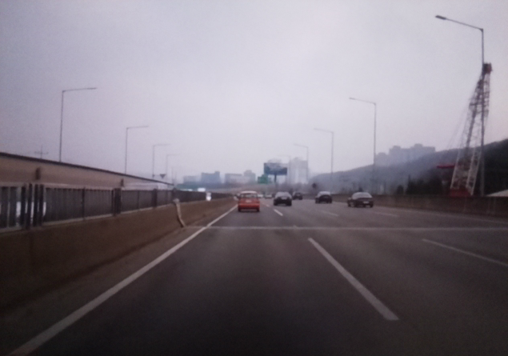
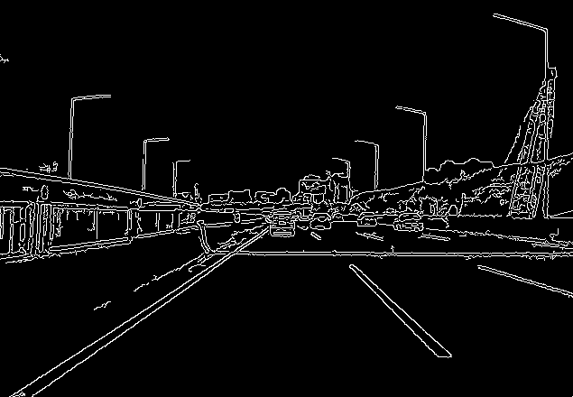
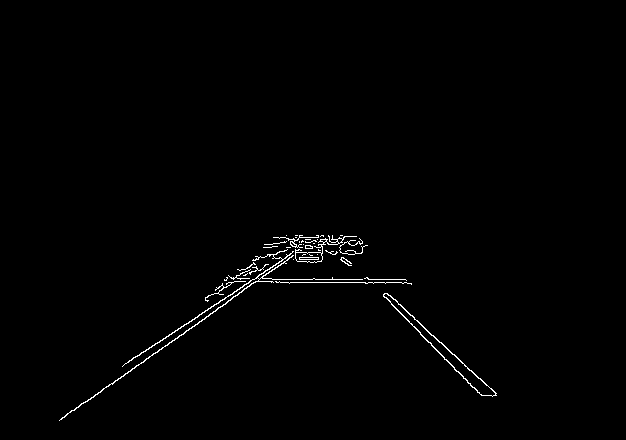
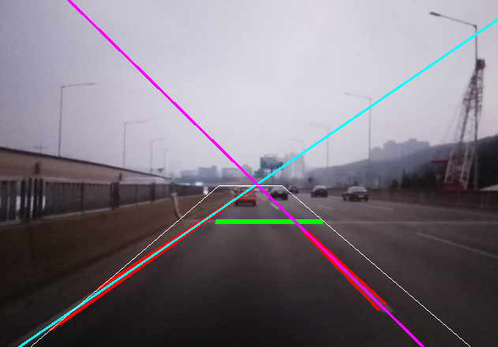

# LDW for Raspberry Pi

## Overview
This repository contains code of Lane Departure Warning system for Raspberry Pi with monocular camera.

## How it works
* 
    * origianl image
*
    * Canny edge detection
*
    * Region of interest
*
    * Detect road lines

## Requirements
* Software
    * Raspbian
    * OpenCV
    * CMake
    * ALSA
    * Xming (optional)
* Hardware
    * Raspberry Pi 4
    * Raspberry Pi Camera Module v1

## Compile
```
mkdir <project-directory>
cd <project-directory>
git clone https://github.com/sjleo1/LaneDepartureWarning-for-RaspberryPi.git
mkdir build
cd build
cmake ..
make
```

## How to use
This code had been written for Raspberry Pi Camera Module v1, which has horizontal/vertical field of view of 53° / 41°. The camera should be installed at the center of the windshield with the height of 1.5 meter above the ground looking forward direction.
* ### Run program
```
adas
```
* ### Run program for camera setup
```
adas setup
```
To setup camera.
* ### Run program with visualization
```
adas visual
```
To visualize image processing techniques used to detect traffice lines.

## Result


## Acknowledgements


---